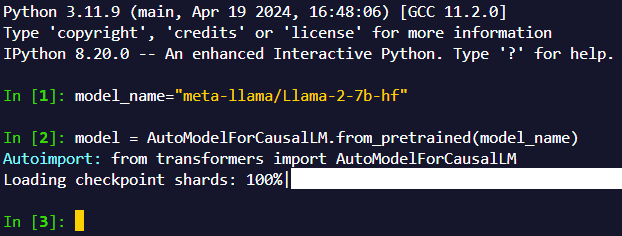

记录一些无限拔高Python技术的小技巧。

# 高效工具

## IPython auto import

一般来说，如果你希望自动导入一个库，可以设置一些类似启动脚本之类的东西。但你不想每次进来都花很久导入torch和transformers，也不希望还得手动补个什么库。这时你就应该用这个自动导入插件。

[ipython-autoimport](https://github.com/anntzer/ipython-autoimport)

安装/启用：

```shell
pip install ipython-autoimport
ipython profile create # Optional
python -m ipython_autoimport >> $(ipython profile locate)/ipython_config.py
```

看看效果：

